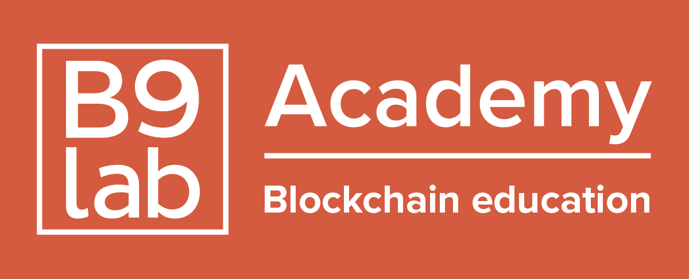

# B9lab Splitter

This is the first project of B9lab, BLOCKSTARS-ETH-2. :tada:

### Basic

- there are 3 people: Alice, Bob and Carol.
- we can see the balance of the Splitter contract on the Web page.
- whenever Alice sends ether to the contract for it to be split, half of it goes to Bob and the other half to Carol.
- we can see the balances of Alice, Bob and Carol on the Web page.
- Alice can use the Web page to split her ether.

### App Development

```sh
$ cd app
$ yarn
```

```sh
$ yarn serve
```

And you need to run Ganache environment as well.
Open another terminal and run below,

```sh
$ yarn serve:eth
```

### Ethereum Solidity Development

Install all packages you need for development.

```sh
$ cd ethereum
$ yarn
```

Test, complile, deploy, and migrate a contract.

```sh
$ yarn test
$ yarn compile
$ yarn deploy
$ yarn migrate
```
